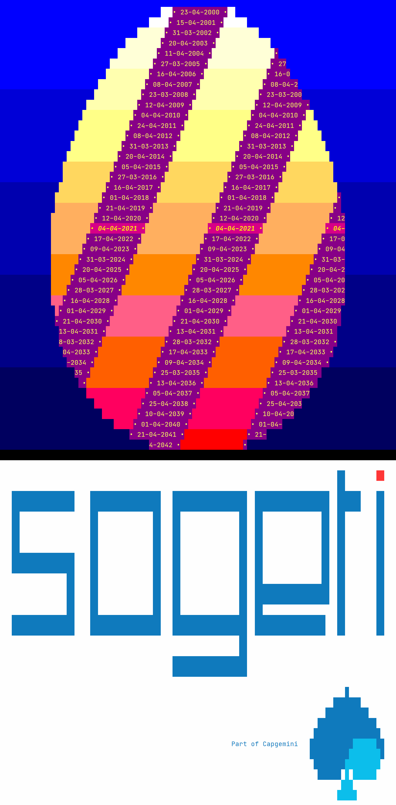

---

<h1 style="color:#12ABDB">  Paasei </h1>
<h6 style="color:#12ABDB">| Dutch version   |</h6>

#### Daar istie dan, mijn paasei!
#### Een vrolijk gekleurd ei, met mooie linten erom. Niet alleen voor de aankomende paasdagen, maar ook een herinnering aan de paasdagen die achter ons liggen en een vooruitblik op wat ons nog te wachten staat.

## Fijne Paasdagen!

--- 

---

<h1 style="color:#12ABDB">  Easter Egg </h1>

<h6 style="color:#12ABDB">| English version   |</h6>

----

#### Here it is, my Easter egg!
#### A colorful egg with fancy ribbons that not only tell us when Easter is this year, but also when it was in the past and when it will be in years to come.
## Happy Easter!

---

---
